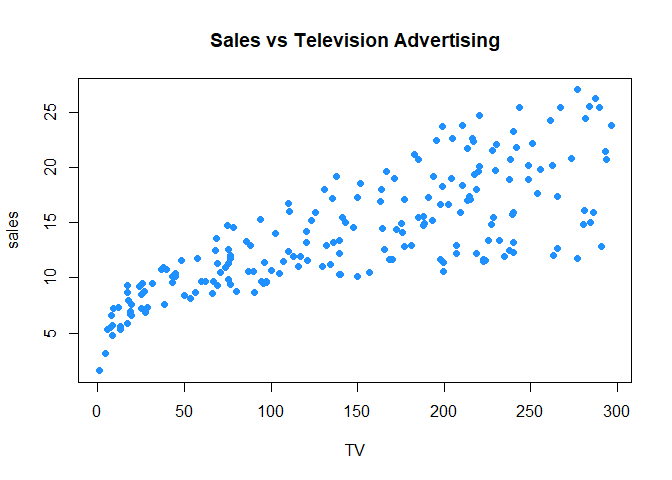
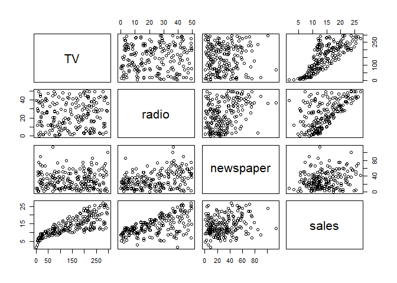
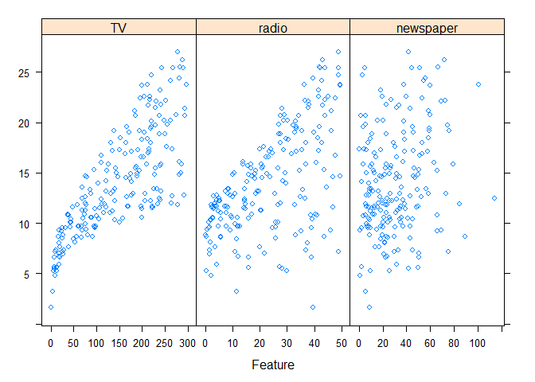

Modeling Basics in R
================
pkazamias
2021-05-31

``` r
# Libraries 
library(readr)
```

    ## Warning: package 'readr' was built under R version 4.0.5

``` r
library(here)
```

    ## here() starts at C:/pkaza/projects/personal/stats/r4stats

``` r
# Load data

Advertising<-read_csv(here("data","Advertising.csv"))
```

    ## Warning: Missing column names filled in: 'X1' [1]

    ## 
    ## -- Column specification --------------------------------------------------------
    ## cols(
    ##   X1 = col_double(),
    ##   TV = col_double(),
    ##   radio = col_double(),
    ##   newspaper = col_double(),
    ##   sales = col_double()
    ## )

``` r
Advertising<-Advertising[,-1]
Advertising # Because the data was read using read_csv(), advertising is a tibble.
```

    ## # A tibble: 200 x 4
    ##       TV radio newspaper sales
    ##    <dbl> <dbl>     <dbl> <dbl>
    ##  1 230.   37.8      69.2  22.1
    ##  2  44.5  39.3      45.1  10.4
    ##  3  17.2  45.9      69.3   9.3
    ##  4 152.   41.3      58.5  18.5
    ##  5 181.   10.8      58.4  12.9
    ##  6   8.7  48.9      75     7.2
    ##  7  57.5  32.8      23.5  11.8
    ##  8 120.   19.6      11.6  13.2
    ##  9   8.6   2.1       1     4.8
    ## 10 200.    2.6      21.2  10.6
    ## # ... with 190 more rows

``` r
# Visualization for regression

plot(sales ~ TV, data = Advertising, col = "dodgerblue", pch = 20, cex = 1.5,main = "Sales vs Television Advertising")
```

<!-- -->

``` r
pairs(Advertising)

library(caret)
```

    ## Warning: package 'caret' was built under R version 4.0.5

    ## Loading required package: lattice

    ## Loading required package: ggplot2

<!-- -->

``` r
featurePlot(x = Advertising[ , c("TV", "radio", "newspaper")], y = Advertising$sales)
```

<!-- -->

``` r
# The lm() function
mod_1 = lm(sales ~ ., data = Advertising)
mod_0 = lm(sales ~ TV+radio, data = Advertising)

# Hypothesis testing

summary(mod_1)
```

    ## 
    ## Call:
    ## lm(formula = sales ~ ., data = Advertising)
    ## 
    ## Residuals:
    ##     Min      1Q  Median      3Q     Max 
    ## -8.8277 -0.8908  0.2418  1.1893  2.8292 
    ## 
    ## Coefficients:
    ##              Estimate Std. Error t value Pr(>|t|)    
    ## (Intercept)  2.938889   0.311908   9.422   <2e-16 ***
    ## TV           0.045765   0.001395  32.809   <2e-16 ***
    ## radio        0.188530   0.008611  21.893   <2e-16 ***
    ## newspaper   -0.001037   0.005871  -0.177     0.86    
    ## ---
    ## Signif. codes:  0 '***' 0.001 '**' 0.01 '*' 0.05 '.' 0.1 ' ' 1
    ## 
    ## Residual standard error: 1.686 on 196 degrees of freedom
    ## Multiple R-squared:  0.8972, Adjusted R-squared:  0.8956 
    ## F-statistic: 570.3 on 3 and 196 DF,  p-value: < 2.2e-16

``` r
summary(mod_0)
```

    ## 
    ## Call:
    ## lm(formula = sales ~ TV + radio, data = Advertising)
    ## 
    ## Residuals:
    ##     Min      1Q  Median      3Q     Max 
    ## -8.7977 -0.8752  0.2422  1.1708  2.8328 
    ## 
    ## Coefficients:
    ##             Estimate Std. Error t value Pr(>|t|)    
    ## (Intercept)  2.92110    0.29449   9.919   <2e-16 ***
    ## TV           0.04575    0.00139  32.909   <2e-16 ***
    ## radio        0.18799    0.00804  23.382   <2e-16 ***
    ## ---
    ## Signif. codes:  0 '***' 0.001 '**' 0.01 '*' 0.05 '.' 0.1 ' ' 1
    ## 
    ## Residual standard error: 1.681 on 197 degrees of freedom
    ## Multiple R-squared:  0.8972, Adjusted R-squared:  0.8962 
    ## F-statistic: 859.6 on 2 and 197 DF,  p-value: < 2.2e-16

``` r
anova(mod_0,mod_1) #compare the two models
```

    ## Analysis of Variance Table
    ## 
    ## Model 1: sales ~ TV + radio
    ## Model 2: sales ~ TV + radio + newspaper
    ##   Res.Df    RSS Df Sum of Sq      F Pr(>F)
    ## 1    197 556.91                           
    ## 2    196 556.83  1  0.088717 0.0312 0.8599

The anova() function performs a hypothesis test comparing the two
models. Essentially we are testing for the significance of the Newspaper
variable in the additive model. The null hypothesis is that the two
models fit the data equally well, and the alternative hypothesis is that
mod1 (full additive model) is superior. Low F-statistic and not
significant p-value means that we cannot reject the null hypothesis.

``` r
# Prediction

head(predict(mod_1), n = 10) #Predicted values for the first 10 observations based on mod_1
```

    ##         1         2         3         4         5         6         7         8 
    ## 20.523974 12.337855 12.307671 17.597830 13.188672 12.478348 11.729760 12.122953 
    ##         9        10 
    ##  3.727341 12.550849

We could also specify new data, which should be a data frame or tibble
with the same column names as the predictors.

``` r
new_obs = data.frame(TV = 150, radio = 40, newspaper = 1)
predict(mod_1, newdata = new_obs,interval="confidence")
```

    ##        fit      lwr      upr
    ## 1 17.34375 16.77654 17.91096

``` r
predict(mod_1, newdata = new_obs, interval = "prediction", level = 0.99)
```

    ##        fit      lwr      upr
    ## 1 17.34375 12.89612 21.79138
